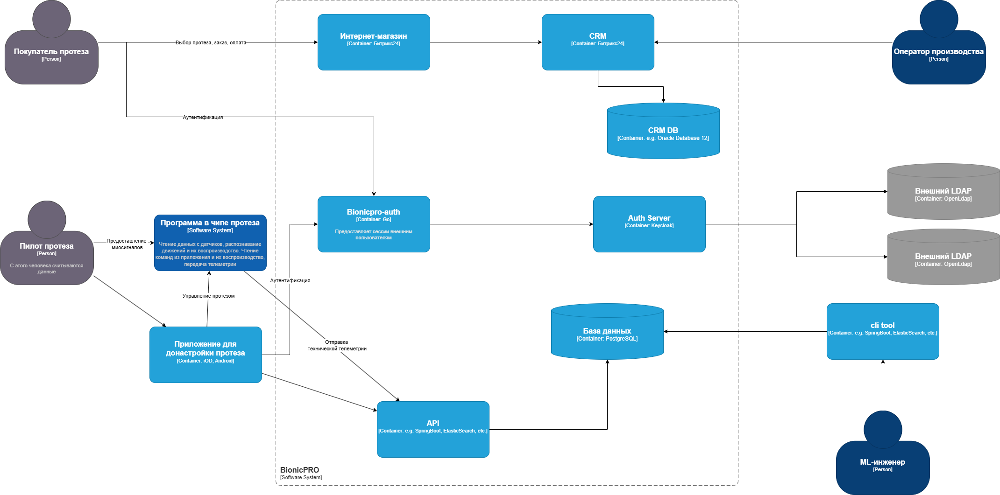
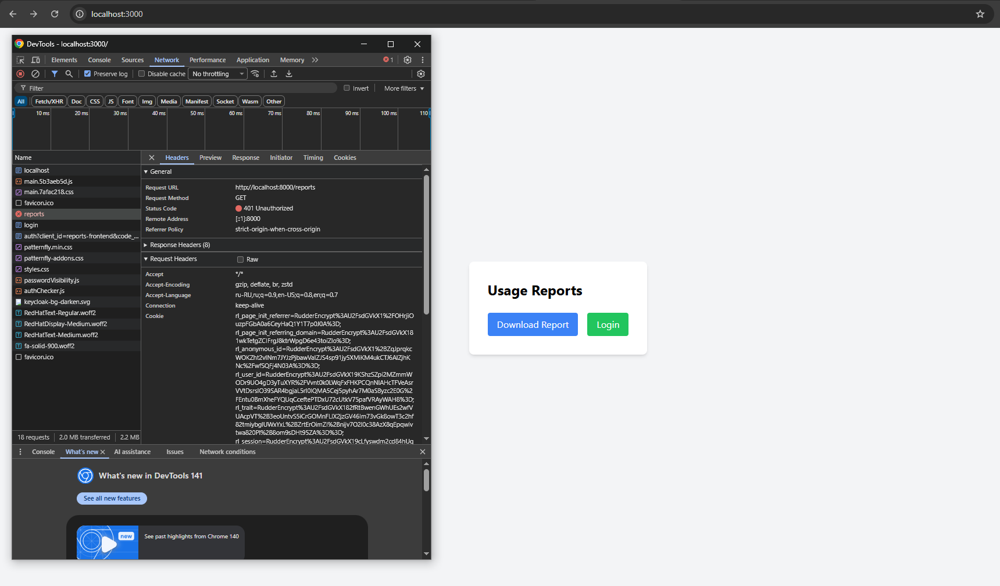

## Запуск
Для запуска debezium надо дать права на файл инициализации

```bash
chmod +x debezium/setup-connector.sh

docker compose up -d --build
```

Так же зайти в keycloak и руками пробросить секреты, они не экспортируются

## Файлы для сдачи задания:

Диаграмма: 



[Код сервиса Авторизации](./bionicpro-auth/main.go)

[Код ручки получения отчетов](./bionicpro-auth/report_handler.go)

[Фронтенд, который ходит в новую Авторизацию](./frontend/src/components/ReportPage.tsx)

[Экспорт реалмов из keycloak](./keycloak/realm-export-full.json)

[DAG для Airflow](./airflow/dags/telemetry_to_clickhouse.py)

[Конфиг nginx](./nginx/nginx.conf)

[Инициализация debezium](./debezium/setup-connector.sh)

[Инициализация Clickhouse](./init/clickhouse_init.sql)

## Процесс логина:

1. UnAuthorized при попытке скачать отчет без логина ([обработка в go сервисе](./bionicpro-auth/report_handler.go)), будет редирект на keycloak



2. Сам редирект на keycloak


3. Редирект на одноразовый пароль при верном пароле


4. При первом логине там будет qr код на otp, я использовал google authentificator для сканирования. Там <название моего реалма:логин пользователя>


5. Если на yandex нажать, он сделает редирект на яндекс форму


6. Возврат на страницу с загрузкой отчета

[!base page](./screenshots/redirect%20after%20auth.png)

7. Скачивание отчета при наличии сессии


